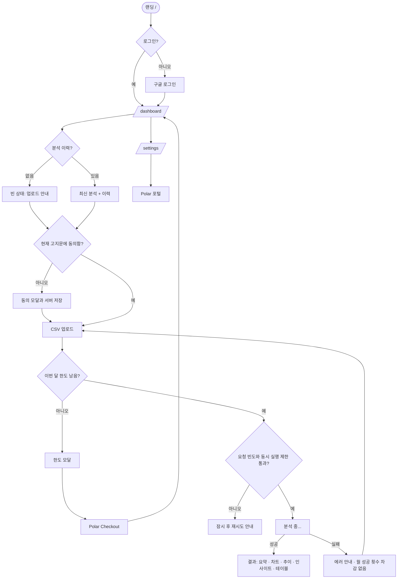
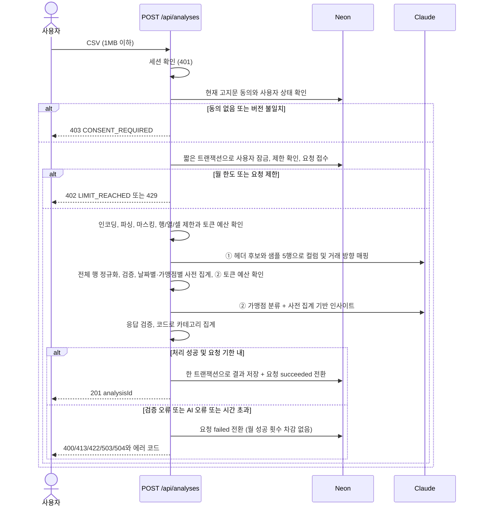
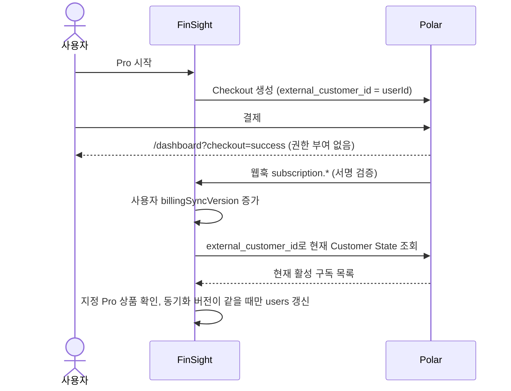

# FinSight MVP 계획 (리뷰 반영판)

## Context
사용자가 카드 명세서나 거래내역 CSV를 올리면 Claude가 분석해서 대시보드로 보여주는 핀테크 SaaS의 **MVP**다. 목표는 **빠르게 동작하는 프로토타입으로 핵심 가설을 검증하는 것**이다.
MVP 범위는 랜딩 페이지 → 대시보드, 구글 로그인, Polar 결제, Vercel 배포까지다.
직전 버전은 사용자 여정, 엣지 케이스, 보안 검토를 거치면서 과하게 커졌다. 그래서 **"이게 없으면 MVP가 안 돌아가거나, 법적·보안상 사고가 나는가?"**를 기준으로 다시 걸렀다.
Harness 절차는 문서 작성 → `phases/0-mvp` step 생성 → `scripts/execute.py` 실행 순서다.
이번 개정은 월 한도 우회, 실패 요청 비용, 거래 정규화, 구독 상태 동기화, 서버 동의 검증, AI 호출 순서, 가설 측정, 동기 처리 상한에 대한 리뷰를 반영한다. **동기 처리·AI 호출 2회·Harness 9단계는 유지**한다.

## 0. 이번 검수에서 뺀 것과 단순화한 것
| 이전 계획 | 변경 | 이유 |
|---|---|---|
| 비동기 처리(202 + 폴링 + 처리 중 상태 복구) | **동기 처리** + 로딩 스피너, `maxDuration = 300` | 전체 처리 기한과 AI 호출별 제한을 별도로 두고 최악 입력을 검증한다 |
| 4MB / 5,000행 / 50열 | **1MB / 2,000행 / 50열** | 행 수와 함께 셀 길이·토큰 예산도 제한한다. 작은 파일도 처리 시간은 실측한다 |
| 행 청크 병렬 분류 | **가맹점명 중복 제거 후 한 번에 분류** | 중복이 없는 2,000개 가맹점도 검증한다. 예산 초과 입력은 호출 전에 거절한다 |
| 삭제 가능한 분석 결과로 사용량 COUNT | **요청 메타데이터 `analysis_requests`와 결과 `analyses` 분리** | 결과를 삭제해도 성공 횟수는 유지한다. 실패율·요청 빈도·진행 중 상태도 같은 메타데이터로 관리한다 |
| `subscriptions`, `webhook_events` 전용 테이블 | **`users`에 구독 식별자·동기화 버전 저장 + Polar 현재 상태 재조회** | 과거 이벤트의 재전송과 동시에 완료되는 조회가 현재 권한을 되돌리지 못하게 한다 |
| 복잡한 구독 상태 머신 | **지정한 Pro 상품의 활성 구독이 있으면 Pro** | 웹훅 종류만으로 권한을 바꾸지 않고 현재 Customer State로 판정한다 |
| 앱 레벨 암호화, 보유 기간 자동 삭제 | 제외 (Neon 기본 저장 암호화만 사용) | 정책은 개인정보처리방침에 적는다 |
| Upstash, Sentry, 범용 이벤트 플랫폼 | 제외. **DB 기반 요청 제한 + 최소 측정 메타데이터** | 성공 횟수 제한과 실패·반복 요청의 비용 제한을 분리한다 |
| 클라이언트 idempotencyKey, 중복 파일 해시 | 제외. 버튼 비활성화 + **서버에서 사용자당 진행 중 요청 1개** | 완료 저장은 서버 요청 ID로 한 번만 처리한다. 재업로드한 같은 파일은 별도 분석으로 취급한다 |
| 할부, 승인·취소 쌍, 연도 없는 날짜 전용 로직 | 정교한 처리는 제외. **표준 거래 구조로 정규화할 수 없는 형식은 거절** | 음수만으로 환불을 추정하거나 AI가 보지 못한 전체 거래의 의미를 추측하지 않는다 |
| `/sample` 샘플 대시보드 | 랜딩에 **스크린샷 이미지**로 대체 | |
| 테이블 검색·필터, 카테고리 수동 수정 | 제외 (날짜순 테이블만) | |
| `security-review`, `account-deletion`, `usage-limit` step | 다른 step에 합침. **step 13개 → 9개** | |

**남긴 것 (싸고, 빠지면 사고가 나는 것)**
- 조회·삭제·설정 API 모두 본인 데이터만 접근(userId 조건)
- Polar 웹훅 서명 검증(SDK)
- API 키는 서버 전용
- AI 출력은 일반 텍스트로만 렌더링
- 구조화 출력과 카테고리 enum
- 원본 CSV 저장 금지
- 카드번호·계좌번호 등 식별정보 마스킹과 AI 전송 항목 최소화
- **국외 이전 동의 UI + 서버 검증 + 고지문 버전 기록**
- 결과 삭제와 독립된 월 사용량, 요청 빈도 제한, 사용자당 동시 분석 1개
- KST 기준 월 계산
- 로그에 CSV 내용을 남기지 않기

## 1. 결정 사항
| 항목 | 결정 |
|---|---|
| 스택 | Next.js 15 App Router, TypeScript, Tailwind, Vitest, Vercel |
| 인증 | Auth.js v5, 구글만, **JWT 세션**(어댑터 없음). signIn 콜백에서 구글 `sub` 기준으로 users upsert |
| DB | Neon Postgres + Drizzle, **테이블 3개**: users, analyses, analysis_requests |
| 결제 | Polar. Free 월 3회, Pro 월 9,900원(가정)·월 100회 |
| AI | `claude-sonnet-5-5`, 분석당 최대 2회 생성 호출(① 컬럼·거래 방향 매핑 ② 가맹점 분류 + 사전 집계 기반 인사이트). 모델 ID는 서버 설정으로 관리 |
| 차트 | Recharts |
| 언어·통화 | 한국어, KRW (외화 행은 합계에서 빼고 표시만) |

### 거래 정규화와 AI의 역할
- 표준 거래 구조: `date(YYYY-MM-DD)`, `merchant`, `amount(0 이상의 유한수)`, `currency`, `direction(expense | income | refund | transfer)`, `status(posted | cancelled)`. KRW는 정수 원 단위로 계산한다.
- ① AI는 헤더 위치·컬럼과 금액 표현 방식(입금/출금 분리, 부호, 거래 구분 컬럼)을 매핑한다. **실제 모든 행의 변환·검증·합계는 코드가 수행**한다. 날짜·통화·방향을 확정할 수 없으면 `422 UNSUPPORTED_FORMAT`이다.
- 부호형 은행 CSV에서 출금 음수는 `expense`와 양수 금액으로 정규화한다. 환불은 파일의 명시적 거래 구분 등 검증 가능한 근거가 있을 때만 `refund`로 처리한다. 잔액 컬럼은 거래금액으로 사용하지 않는다.
- KRW의 확정 거래만 집계한다. `expense` 합계에서 `refund` 합계를 차감한 값을 순지출로 표시하고, 입금·이체·외화·취소 행은 지출 합계에서 제외한다. 외화와 제외 건수는 결과에 표시한다.
- 월 명세서의 할부 청구금액처럼 이미 확정된 금액은 그대로 사용한다. 할부 총액을 월별로 나누거나 승인·취소 쌍을 매칭해야 하는 파일, 연도 추정이 필요한 파일은 MVP에서 거절한다. 파싱 불가 거래를 조용히 누락하지 않는다.
- ① 완료 후 코드가 날짜별·가맹점별 금액/건수와 전체 입금·지출·환불을 먼저 집계한다. ②에는 이 집계와 중복 제거한 가맹점 목록을 보낸다. 인사이트는 **이 사전 집계에 근거한 내용으로 한정**한다.
- ②가 반환한 모든 가맹점의 분류를 검증한 뒤 코드가 카테고리 합계를 계산한다. 카테고리 합계에 의존하는 설명은 코드 템플릿으로 생성한다. AI가 반환한 숫자를 대시보드의 집계 원본으로 사용하지 않는다.

## 2. 페르소나와 가설
- **핵심 페르소나**: 카드 2~3장을 쓰는 직장인. 계좌 연동은 꺼리지만 "이번 달 돈이 어디로 갔는지" 궁금하다.
- H1. 연동 없이 CSV만 올리는 방식이 신뢰 장벽을 낮춘다 → 랜딩 → 로그인 전환율
- H2. 명시한 지원 범위의 CSV를 별도 편집 없이 분석할 수 있다 → 첫 분석 성공률
- H3. 첫 인사이트를 본 사용자가 다시 온다 → 재업로드율
- H4. 한도에 걸린 사용자 일부가 결제한다 → 한도 도달 → 결제 전환율
- 측정: Vercel Analytics 방문자 수 + 운영자의 `analysis_requests`, `users` 조회. 거래 내용 없는 요청 메타데이터는 분석 결과 삭제와 독립적으로 유지한다.

| 지표 | 계산식과 관찰 기간 |
|---|---|
| H1 로그인 전환 | 같은 기간의 신규 users 수 ÷ 랜딩 고유 방문자 수. 익명 방문과 계정을 연결하지 않는 근사 지표임을 명시한다 |
| H2 첫 분석 성공 | 첫 접수 요청이 성공한 사용자 수 ÷ 첫 접수 요청의 처리가 끝난 사용자 수. 기한 초과도 실패에 포함한다 |
| H3 재업로드 | 관찰 완료 집단 중 첫 성공과 다른 KST 날짜에 7일 이내 재분석에 성공한 사용자 수 ÷ 첫 성공 후 7일 관찰이 끝난 사용자 수 |
| H4 한도 후 결제 | 관찰 완료 집단 중 한도 도달 후 7일 이내 Pro 전환한 사용자 수 ÷ Free 한도 최초 도달 후 7일 관찰이 끝난 사용자 수 |

`analysis_requests`의 접수·성공·실패 시각/코드와 `users.firstLimitReachedAt`, `firstProAfterLimitAt`으로 계산한다. 401·동의 미완료·402·429는 분석 접수에서 제외한다. 처리 기한이 지난 진행 중 요청은 실패로 집계한다. 관찰 기간이 끝나지 않은 사용자는 H3/H4의 분모와 분자에서 모두 제외하며, 분모가 0이면 전환율을 미집계로 표시한다.

## 3. 사용자 여정
- **J1 첫 방문 → 첫 분석**: 랜딩(가치 제안, 보안 약속, 스크린샷, 가격) → "무료로 분석하기" → 구글 로그인 → 대시보드 빈 상태 → 첫 업로드 또는 고지문 버전 변경 시 국외 이전 동의 → 서버에 동의 저장 → CSV 업로드 → 로딩 → 결과
- **J2 재방문**: 로그인 상태면 랜딩 CTA가 "대시보드로" → 최신 분석 + 이력 목록 → 새 업로드나 이전 분석 보기·삭제
- **J3 한도 → 결제**: 업로드 시 402 → 한도 모달 → Polar Checkout → 돌아와서 "결제 반영 확인" 버튼 → 서명 검증된 웹훅 또는 서버 재조회로 Pro 전환. 성공 리다이렉트 자체는 권한을 부여하지 않는다.
- **J4 구독 관리**: `/settings` → Polar 고객 포털 링크(해지와 결제수단은 Polar가 처리)
- **J5 로그아웃** (계정 삭제는 개인정보처리방침에 이메일 요청으로 안내하고, MVP에서는 수동 처리)

### D1. 전체 흐름

### D2. 업로드 → 분석 (동기)

실패가 확정된 단계에서 즉시 종료하며 이후 AI 호출은 수행하지 않는다. 외부 AI 호출 중 DB 트랜잭션이나 행 잠금을 유지하지 않는다. 강제 종료되어 실패 저장을 못 한 요청은 `expiresAt` 경과 시 실패로 취급한다.

### D3. 결제

### 동의·사용량·비용 제한
- `POST /api/consent`는 로그인 사용자와 현재 고지문 버전, 명시적 동의 값을 검증하고 서버 시각으로 `consentedAt`, `consentVersion`을 저장한다. `POST /api/analyses`는 **본문을 외부로 전송하기 전에** 두 값을 확인한다. 버전이 바뀌면 다시 동의받는다.
- 서비스별 이전 항목·목적·수신자·국가·시점/방법·보유 기간·거부 방법과 영향을 실제 설정에 맞게 고지한다. 로그인 시점의 프로필 저장과 업로드 후 AI 처리를 구분해 각각의 국외 이전 근거를 설계 문서에 기록한다. 체크박스만으로 모든 처리를 포괄한다고 가정하지 않는다.
- 원본 CSV는 저장하지 않는다. AI에는 마스킹한 샘플과 분석에 필요한 항목만 전송하고, 계좌번호·카드번호·개인 식별정보와 불필요한 메모를 제거한다. 결과는 사용자가 삭제할 때까지, 요청 메타데이터는 계정 유지 기간 동안 보관하며 계정 삭제 시 함께 삭제한다. 외부 제공자의 보유 정책은 별도로 확인·고지한다.
- 월 한도는 **접수 시각의 KST `usageMonth`에 속한 성공 요청 수**로 계산한다. 월말 접수 후 다음 달에 완료되어도 접수 월에 귀속한다. 분석 결과 DELETE는 요청 기록과 성공 상태를 변경하지 않는다.
- 접수 시 사용자 행을 짧게 잠그고 만료 요청 정리, 진행 중 요청·월 한도·요청 빈도 확인, `running` 요청 생성을 원자적으로 수행한다. 사용자당 진행 중 요청은 1개이며, 성공 수와 유효한 진행 중 요청이 월 한도를 넘지 못하게 한다.
- 초기 요청 제한은 **사용자당 최근 60초 3회, 최근 24시간 Free 20회 / Pro 200회**다. DB 시각 기준의 이동 구간으로 계산하며 접수한 요청은 성공·실패에 관계없이 포함한다. 월 성공 한도 초과는 402, 진행 중/요청 빈도 초과는 429와 `Retry-After`로 응답한다. 인스턴스 메모리가 아닌 DB에서 판정한다.
- 실패는 월 성공 한도를 소모하지 않지만 요청 빈도 제한에는 남는다. 클라이언트 버튼 비활성화는 보조 수단이다. 운영 단계에서는 이 제한 안의 최대 비용을 계산하고 제공자 지출 제한과 대조한다.

### 동기 처리 시간과 토큰 예산
- Vercel Node.js 런타임에서 `maxDuration = 300`, 요청 접수부터의 애플리케이션 처리 기한은 **240초**로 둔다. AI 요청은 호출당 최대 **90초**와 남은 전체 시간 중 짧은 값을 적용하고, 파싱·DB 저장 시간도 전체 기한에 포함한다.
- SDK 자동 재시도는 **0회로 명시**해 분석당 최대 2회 생성 호출을 지킨다. 기한이 지나면 외부 요청을 중단하고 `504 ANALYSIS_TIMEOUT`으로 처리한다. 만료 요청의 늦은 응답은 결과/성공 기록을 저장하지 못한다.
- 초기 입력 토큰 예산은 ① 8,000 / ② 48,000, `max_tokens`는 ① 2,000 / ② 16,000으로 설정한다. 시스템 지시문과 스키마를 포함해 SDK 토큰 계산 기능으로 각 생성 호출 직전에 검사한다. 토큰 계산용 API 요청은 생성 호출 2회와 별도이며 동의·마스킹·전체 처리 기한은 동일하게 적용한다.
- 최대 50열, 셀당 1,000자, 가맹점당 200자를 적용한다. 허용량을 넘으면 AI 호출 전에 `422 INPUT_TOO_COMPLEX`로 거절하고 파일을 나눠 올리도록 안내한다. 수치들은 초기 운영값이며 프리뷰 실측 결과를 기준으로 확정한다.
- 구조화 출력 외에도 가맹점 ID의 누락·중복·알 수 없는 ID, 카테고리 enum, 출력 잘림을 검증한다. 2,000개 가맹점의 결과가 예산에 들어가지 않으면 가맹점 상한을 낮추고 안내·테스트를 함께 변경한다. 일부만 성공 처리하지 않는다.

### 결제 상태 동기화
- 서명 검증 후 웹훅의 `active`/종료 상태를 그대로 덮어쓰지 않고, 서버가 `external_customer_id = users.id`로 Polar Customer State를 재조회한다. 웹훅은 검증된 고객 연결 정보로 사용자를 찾고, refresh는 로그인 세션의 내부 userId를 사용한다.
- 지정한 서버 설정의 Pro 상품에 활성 구독이 하나라도 있으면 Pro다. 다른 상품의 구독은 무시한다. 대표 활성 구독 ID와 상태를 저장하고, 활성 구독이 없으면 Free로 갱신한다. 과거 구독 종료 이벤트가 새 활성 구독을 제거하지 않는다.
- 동기화 시작 시 `billingSyncVersion`을 증가시키고, 조회 결과는 해당 버전이 여전히 현재일 때만 저장한다. 모든 동기화 경로에 같은 규칙을 적용해 먼저 시작한 조회가 늦게 완료되어도 최신 결과를 덮어쓰지 못하게 한다. 조회·DB 오류는 웹훅에서 5xx로 응답해 재시도하게 한다.
- 결제 복귀 화면의 `POST /api/billing/refresh`도 인증된 사용자에 대해 같은 재조회 경로를 사용한다. 사용자당 10초에 1회로 제한하며 웹훅 지연·누락 시 복구 경로로 제공한다. 단순 화면 새로고침만으로 동기화된다고 가정하지 않는다.
- Free 사용자의 첫 `LIMIT_REACHED` 시각과 이후 최초 Pro 전환 시각을 한 번만 기록한다. 웹훅 중복 처리나 결과 삭제로 이 측정값을 바꾸지 않는다.

## 4. 꼭 처리할 에러와 엣지 케이스 (이 정도로 충분)
| 상황 | 처리 |
|---|---|
| CSV가 아님, 빈 파일, 1MB 초과, 2,000행 초과 | 400/413 + 안내 문구 (클라이언트에서도 확장자와 크기 검사) |
| 현재 버전 동의 없음 | 외부 전송 없이 403 `CONSENT_REQUIRED` → 동의 화면 |
| 이미 분석 중, 요청 빈도/24시간 제한 초과 | 429 `ANALYSIS_IN_PROGRESS` / `RATE_LIMITED`, `Retry-After` 안내 |
| 월 성공 한도 초과 | 402 `LIMIT_REACHED`. 결과 삭제로 복구되지 않는다 |
| 한글 깨짐(EUC-KR) | UTF-8 디코딩이 실패하거나 깨진 문자(`�`)가 있으면 EUC-KR로 다시 디코딩 |
| 카드사 CSV 윗부분의 안내 문구나 합계 행 | 헤더 후보를 제한된 범위에서 제공하고 AI가 헤더 위치를 매핑한다. 코드가 식별된 안내/합계 행만 제외하고, 날짜가 잘못된 거래 행은 오류로 처리한다 |
| 거래내역이 아닌 파일 | 422 `NOT_TRANSACTIONS`. 결과는 저장하지 않고 실패 요청 메타데이터만 남긴다. 월 성공 횟수는 차감하지 않는다 |
| 방향·날짜·통화 불명확, 미지원 할부/취소 형식 | 422 `UNSUPPORTED_FORMAT`. 임의 추정이나 부분 집계 금지 |
| 열/셀/가맹점 길이·입력 토큰 예산 초과 | 422 `INPUT_TOO_COMPLEX`, 파일 분할 안내 |
| Claude 오류, 출력 잘림, 가맹점 누락, zod 검증 실패 | 재시도 없이 503 `AI_UNAVAILABLE`. 요청 실패 메타데이터만 저장 |
| 전체 처리 기한 초과 | 504 `ANALYSIS_TIMEOUT`, 월 성공 횟수 차감 없음. 만료된 요청의 늦은 결과 저장 금지 |
| 다른 사용자의 분석 ID로 접근 | 404 |
| 세션 만료 | 401 → 로그인 → 대시보드 |
| 거래 1건뿐이거나 기간 하루뿐, 입금만 있음 | 차트 대신 설명 문구 |
| 결제는 됐는데 웹훅이 늦게 옴 | "결제 반영 확인" 버튼으로 서버 현재 상태 재조회 |
| 웹훅 재전송·순서 역전·복수 구독 | 현재 상태 재조회 + 동기화 버전 검사. 지정 상품 활성 구독 기준으로 권한 판정 |
| Polar 조회/DB 갱신 실패 | 웹훅은 5xx, 기존 권한 상태 유지. refresh API는 오류 안내 |
| 모르는 사용자 앞으로 온 웹훅 | 로그만 남기고 200 반환 |

에러 응답 형식은 `{ error: { code, message } }` 하나로 통일한다. 업로드/결제 API의 예상 오류는 해당 화면에서 코드별로 표시하고, 예상하지 못한 화면 오류에는 `app/error.tsx`와 `not-found.tsx`를 사용한다. 실패 요청도 `analysis_requests`에 남지만 분석 결과에는 나타나지 않는다.

## 5. 라우트와 데이터
| 라우트 | 내용 |
|---|---|
| `/` | 히어로, 작동 방식, 보안 약속, 스크린샷, 가격, FAQ |
| `/dashboard`, `/dashboard/[id]` | 업로드, 결과, 이력 (로그인 필요, 미들웨어로 보호) |
| `/settings` | 플랜, 남은 횟수, Polar 포털 링크 |
| `/privacy`, `/terms` | 정적 페이지 (국외 이전 항목 포함) |
| `api/analyses` POST/GET, `api/analyses/[id]` GET/DELETE | 분석 |
| `api/consent` POST | 현재 고지문 버전의 동의 저장 |
| `api/billing/checkout`, `api/billing/portal`, `api/billing/refresh`, `api/webhooks/polar` | Polar |

- `users`: id, googleSub(unique), email, name, consentedAt, consentVersion, polarCustomerId(unique, nullable), polarSubscriptionId(nullable), subscriptionStatus, billingSyncVersion(default 0), billingSyncedAt, billingRefreshRequestedAt, firstLimitReachedAt, firstProAfterLimitAt, createdAt
- `analysis_requests`: id(uuid), userId, usageMonth(KST YYYY-MM), status(running | succeeded | failed), errorCode(nullable), startedAt, expiresAt, completedAt(nullable)
- `analyses`: id(uuid), userId, requestId(unique FK), fileName, periodStart, periodEnd, result(jsonb: summary·categories·daily·monthly·insights·transactions), createdAt
- 요청 메타데이터에는 원본·파일명·가맹점·금액·프롬프트·AI 응답을 저장하지 않는다. 결과 삭제 시 `analyses`만 삭제하고 연결된 `analysis_requests`는 유지한다. 계정 삭제 시에는 세 테이블의 해당 사용자 정보를 모두 삭제한다.
- `analysis_requests`의 `(userId, usageMonth, status)`, `(userId, startedAt)`과 `analyses`의 `(userId, createdAt)`에 인덱스를 둔다. 만료된 running은 다음 접수 시 failed로 전환하고, 통계 조회에서도 즉시 실패로 취급한다.
- 성공 저장은 요청이 여전히 running이고 기한 내인 경우에만 허용한다. 결과 삽입과 succeeded 전환은 동일 트랜잭션으로 처리하며 `requestId` 유일 제약으로 중복 완료를 막는다.
- Pro 판정은 지정 상품의 최신 동기화 결과를 사용한다. 월 사용량은 `analysis_requests`에서 사용자·접수 월·succeeded 조건으로 계산한다. JWT에는 고정된 내부 userId를 전달하고 플랜·동의·사용량은 API에서 DB를 조회한다.
- 미들웨어는 화면 접근을 보조한다. 분석 GET/DELETE와 동의·결제·설정 API는 각각 세션 및 소유권을 검사한다. Checkout/포털/refresh의 고객 ID를 클라이언트 입력으로 신뢰하지 않는다.

## 6. CLAUDE.md CRITICAL 규칙 (6개)
1. `ANTHROPIC_API_KEY`와 `POLAR_*`는 서버 코드에서만 쓴다(`server-only`).
2. 사용자 데이터 조회·삭제에는 항상 `userId = session.user.id` 조건을 붙인다. 결과 삭제가 사용량을 초기화하면 안 된다.
3. 원본 CSV는 디스크, DB, 로그 어디에도 저장하지 않는다. AI 전송 전 서버에서 현재 동의 버전과 마스킹을 확인한다.
4. AI 출력과 가맹점명은 일반 텍스트로만 렌더링한다(`dangerouslySetInnerHTML` 금지).
5. Polar 웹훅은 SDK로 서명을 검증한 뒤 현재 상태를 재조회한다. 권한 갱신은 동기화 버전 조건을 지켜야 한다.
6. 새 로직은 테스트를 먼저 작성한다(TDD). CSV 정규화·집계, 삭제 후 한도 유지, 요청 제한, 동의 검증, 웹훅 순서 역전은 필수다.

## 실행 첫 단계: 설계 문서 구체화
이 계획은 **`D:\AI_Work\Projects\finsight\plan.md`**에 저장되어 있다. 현재 템플릿인 PRD·ARCHITECTURE·ADR·CLAUDE.md에 아래 규칙을 구체화한 뒤 step을 생성한다. 계획에서 구현으로 건너뛰지 않는다.

## 7. Harness step (`phases/0-mvp/`, 9개)
각 step의 공통 AC는 `npm run lint && npm run build && npm run test`다. `test`는 watch 없이 종료되도록 설정하고, 각 단계의 동작 조건과 마지막 검증 시나리오도 통과해야 한다.
1. `project-setup`: Next.js, Tailwind, ESLint, Vitest, 공통 에러 타입
2. `db-auth`: Drizzle 스키마(3개 테이블과 인덱스), Auth.js 구글 로그인, 내부 userId 세션 전달, 미들웨어
3. `csv-parser`: 인코딩, 파싱, 마스킹, 제한, 거래 정규화. 카드·입출금 분리·부호형 은행·환불/미지원 형식의 픽스처 테스트
4. `ai-analysis`: 매핑 → 정규화/사전 집계 → 분류·인사이트 → 카테고리 집계, zod/완전성 검증, 시간·토큰 예산
5. `analysis-api`: POST/GET/DELETE, 동의 API, 요청 접수/완료 트랜잭션, 삭제와 독립된 사용량, 빈도·동시 실행 제한, 최소 측정 기록, 소유권 테스트
6. `dashboard-ui`: 빈 상태, 버전별 동의 모달, 업로드, 요약, 차트, 인사이트, 테이블, 이력, 한도/429/시간 초과 안내
7. `landing-page`: 랜딩, privacy, terms, 로그인 상태에 따라 바뀌는 CTA
8. `billing-polar`: Checkout, 포털, 웹훅, 현재 상태 재조회/버전 갱신, refresh API, 결제 전환 기록, `/settings`
9. `deploy`: Vercel 환경변수와 실행 제한, 마이그레이션, OAuth/웹훅 URL, 최악 입력의 지연·토큰·비용 실측, README

문서 작성 대상:
- `docs/PRD.md`: 1~4장 + D1, 지원/미지원 거래 형식, 가설별 측정 정의
- `docs/ARCHITECTURE.md`: 5장 + D2, D3, 요청 상태/제한 트랜잭션, 동의·웹훅 동기화 규칙
- `docs/ADR.md`: Polar, JWT 세션, 동기 처리와 예산, 요청/결과 분리와 테이블 3개, 원본 미저장
- `CLAUDE.md`: 6장 규칙

## 8. MVP 이후로 미룬 것 (Backlog)
- 비동기 처리와 큰 파일 지원
- IP·디바이스 기반 고급 남용 방지와 별도 rate limit 서비스 (계정별 기본 제한은 MVP에 포함)
- 계정 셀프 삭제
- 카테고리 수동 수정
- 샘플 체험 페이지
- xlsx 지원
- 중복 파일 감지
- 할부와 승인·취소 정교화
- 앱 레벨 암호화
- 범용 이벤트 분석 플랫폼과 상세 퍼널 (최소 가설 측정은 MVP에 포함)
- 여러 달 합산 분석

## 검증
- 각 step의 AC 커맨드를 통과해야 한다.
- 자동 검증 조건:
  - Free 3회 성공 → 분석 결과 전부 삭제 → 다시 업로드해도 402. DELETE 후 요청 메타데이터와 H2/H3 값 유지
  - 비거래 CSV/AI 실패를 반복하면 성공 횟수는 그대로이며 분당·24시간 요청 제한은 작동. 제한된 요청에서 AI 호출 0회
  - 서로 다른 앱 인스턴스에서 같은 사용자가 동시에 업로드해도 진행 중 분석은 1개. 만료 요청은 복구되고 늦은 완료/중복 완료로 결과나 횟수가 추가되지 않음
  - KST 월 경계 전후 접수·완료가 접수 월로 귀속되고, 결과 저장 실패 시 요청 성공 처리도 롤백됨
  - 입금/출금 분리, 음수 출금, 명시적 환불, 외화, 잔액 컬럼으로 계산한 정답과 일치. 연도/방향 불명확·취소쌍 매칭 필요 파일은 명확히 거절
  - 동의 없음·이전 고지문 버전·위조된 동의 요청은 거절되며 외부 AI 전송 0회. 다른 사용자의 GET/DELETE는 모두 404
  - ② 호출 입력에 코드가 계산한 사전 집계가 들어가고, 가맹점 ID 누락/중복·출력 잘림·잘못된 enum은 실패 처리
  - 웹훅 서명 오류, 중복·역순 전달, 오래된 조회의 늦은 완료, 구독 종료 후 재가입을 검증. 현재 활성 Pro 상품 구독과 최종 권한 일치
  - Polar 조회 실패는 웹훅 5xx. 결제 리다이렉트만으로 Pro가 되지 않고 refresh로 복구되며 고객 ID 변조는 거절
  - 성공/실패/기한 초과/삭제/한도 도달/Pro 전환 픽스처로 H1~H4의 분모·분자와 관찰 기간 확인
- 최종 확인 (Vercel 프리뷰):
  - 구글 로그인 → EUC-KR 카드사 CSV와 UTF-8 은행 CSV를 각각 분석
  - 네 번째 업로드에서 402 → Polar 샌드박스 결제 → Pro 전환 확인
  - 거래내역이 아닌 CSV → 422, 월 성공 횟수 차감 없음, 요청 실패 메타데이터와 빈도 제한은 유지
  - 2,000행 모두 서로 다른 가맹점인 입력으로 처리 시간·입출력 토큰·분석당 비용 측정. 예산 내 완전한 결과 또는 사전에 정의된 제한 오류를 확인하고 실제 지원 상한을 고정
  - 느린 AI 응답을 모의해 240초 기한과 오류 안내 검증. 토큰 예산 초과 입력은 해당 분석 호출 전에 거절
  - Free/Pro의 일 최대 접수량·월 성공량에 실패 비용까지 포함해 운영 예산 확인

## 참고 근거
- [Polar 웹훅 전달과 재시도](https://polar.sh/docs/integrate/webhooks/delivery), [Customer State](https://polar.sh/docs/integrate/customer-state)
- [Vercel 함수 제한](https://vercel.com/docs/functions/limitations)
- [Claude 모델 목록](https://platform.claude.com/docs/en/models/overview)
- [개인정보 보호법 제28조의8](https://www.law.go.kr/LSW/lsLinkCommonInfo.do?chrClsCd=010202&lsJoLnkSeq=1034292881) — 실제 이전 근거와 고지 내용은 서비스 설정별로 구체화한다.
